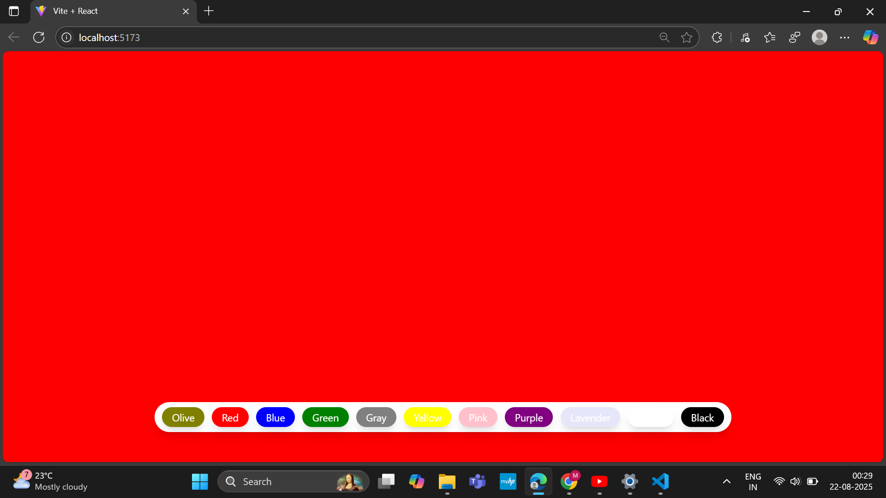

# 🎨 Background Color Changer App

A simple and elegant **React.js project** where you can change the background color of the entire screen by clicking color buttons.  
This project is built with **React + TailwindCSS** for styling.

---

## 📸 Screenshot

---

## ✨ Features

- 🌈 Change background color with one click  
- 🎨 Multiple color options (Olive, Red, Blue, Green, Yellow, Pink, Purple, Lavender, White, Black, Gray)  
- 🖌️ Clean UI with TailwindCSS  
- ⚡ Smooth transitions with CSS animation (`duration-200`)  

---

## 🛠️ Tech Stack

- [React.js](https://react.dev/) ⚛️  
- [TailwindCSS](https://tailwindcss.com/) 🎨 

---

