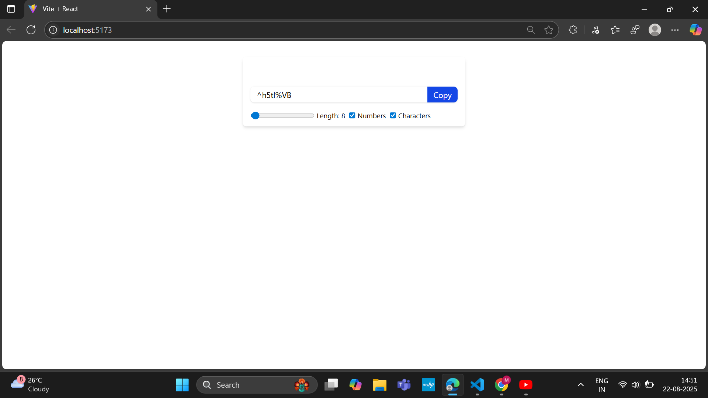

# 🔐 React Password Generator

A simple **Password Generator App** built with React and Tailwind CSS.  
It allows users to generate random secure passwords with customizable length, numbers, and special characters.  
Users can also copy the generated password directly to their clipboard.

---

## 🚀 Features
- ✅ Generate random passwords instantly  
- ✅ Control password **length** (6–100 characters)  
- ✅ Option to include **numbers**  
- ✅ Option to include **special characters**  
- ✅ **One-click copy** to clipboard  
- ✅ Clean UI built with **Tailwind CSS**

---

## 🛠️ Tech Stack
- **React** (with Hooks: `useState`, `useEffect`, `useCallback`, `useRef`)  
- **Tailwind CSS** for styling  
- **Clipboard API** for copying password  

---

## 📸 Preview
*(Add a screenshot of your app here, e.g., `public/image.png`)*

```md

