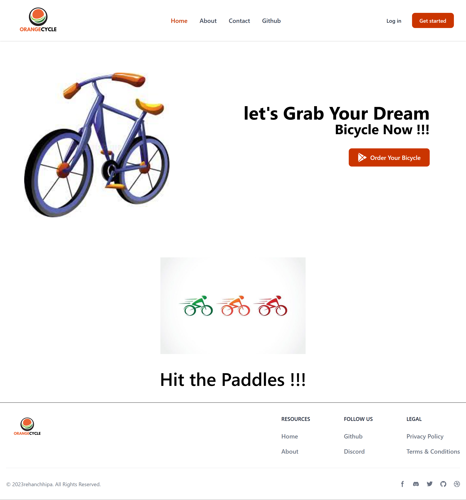
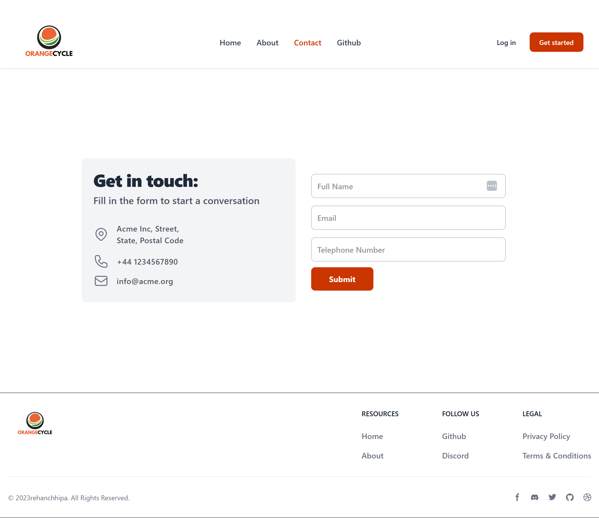
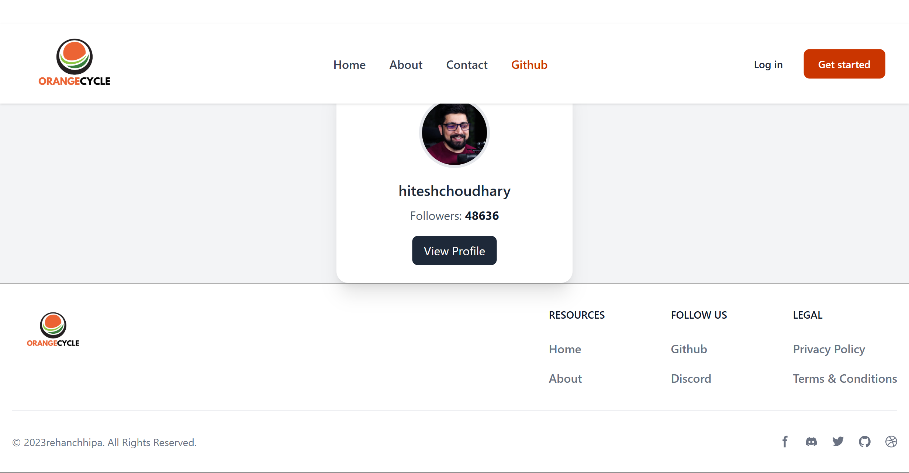

# 🚴 Hercules Bicycle Store

A modern **React + Vite + TailwindCSS** web application showcasing Hercules bicycles with smooth navigation, clean UI, and responsive design.  
It features multiple pages, a dynamic GitHub integration, and a professional layout with reusable components.

---

## 📸 Preview






---

## ✨ Features

- ⚡ **React Router v6** for seamless navigation between pages  
- 🎨 **TailwindCSS** for modern, responsive styling  
- 🧩 **Reusable Components**: Header, Footer, About, Contact, GitHub  
- 👤 **GitHub Integration**: Fetches and displays profile & followers count  
- 📱 Mobile-friendly responsive design  
- 🖼️ Beautiful landing page with bicycle showcase  

---

## 📂 Project Structure


```
src/
├── App.jsx
├── App.css
├── index.jsx
├── index.css
├── Layout.jsx
└── components/
    ├── About/
    │   └── About.jsx
    │
    ├── Contact/
    │   └── Contact.jsx
    │
    ├── Footer/
    │   └── Footer.jsx
    │
    ├── GitHub/
    │   └── GitHub.jsx
    │
    ├── Header/
    │   └── Header.jsx
    │
    ├── Home/
    │   └── Home.jsx
    │
    └── User/
        └── User.jsx

```
---
# 🚀 Pages Overview

- 🏠 **Home**  
  → Hero section with call-to-action & bicycle images  

- ℹ️ **About**  
  → Brand introduction & features of Hercules bicycles  

- 📞 **Contact**  
  → Contact form with company details  

- 🐙 **GitHub**  
  → Fetches GitHub profile data & displays followers with avatar  

---

# 🔧 Technologies Used

- ⚛️ **React**  
- ⚡ **Vite**  
- 🎨 **TailwindCSS**  
- 🛣️ **React Router**  
